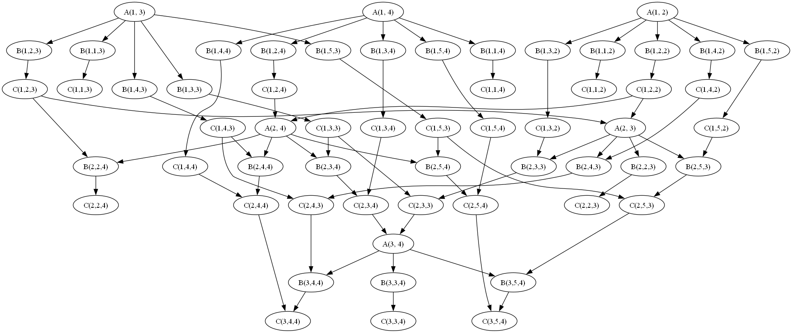

# Concurrent-Gaussian-Elimination

## Overview :blossom:

This repository contains an implementation of a low-level concurrent version of the
Gaussian elimination algorithm in **Java**. The program generates the **Diekert graph**
and computes the **Foata normal form**, which is subsequently used to design the order of concurrent operations by analyzing dependencies and indivisible steps.

## Theoretical Part :mortar_board:

### Gaussian Elimination Method

For a given system of equations:

$$
\begin{bmatrix}
M_{1,1} & M_{1,2} & \cdots & M_{1,m} \\
M_{2,1} & M_{2,2} & \cdots & M_{2,m} \\
\vdots & \vdots & \ddots & \vdots \\
M_{n,1} & M_{n,2} & \cdots & M_{n,m}
\end{bmatrix}
\
\begin{bmatrix}
x_{1} \\
x_{2} \\
\vdots \\
x_{m}
\end{bmatrix}
\=
\begin{bmatrix}
y_1 \\
y_2 \\
\vdots \\
y_n
\end{bmatrix}
$$

we perform Gaussian elimination for the matrix represented as:

$$
\begin{bmatrix}
M_{1,1} & M_{1,2} & \cdots & M_{1,m} & | & y_1 \\
M_{2,1} & M_{2,2} & \cdots & M_{2,m} & | & y_2 \\
\vdots & \vdots & \ddots & \vdots & | & \vdots \\
M_{n,1} & M_{n,2} & \cdots & M_{n,m} & | & y_n
\end{bmatrix}
$$

### Basic Indivisible Computational Tasks

The Gaussian elimination algorithm is divided into the following indivisible operations:

- $A_{i, k}$ - finding the next multiplier for the i-th row to subtract the product from the k-th row: &nbsp; $m_{i, k} := \frac{M_{k, i}}{M_{i, i}}$

- $B_{i, j, k}$ - multiplying the j-th element of the i-th row by the found multiplier in $A_{i, k}$: &nbsp; $n_{i, j, k} = m_{i, k} \cdot M_{i, j}$

- $C_{i, j, k}$ - subtracting the j-th element of the i-th row, multiplied by the multiplier, from the k-th row: &nbsp; $M_{k,j} = M_{k,j} - n_{i,j,k}$

### Alphabet in Terms of Trace Theory

Based on the described indivisible computational tasks, we can formulate an alphabet as follows:

$$
\Sigma = set( A_{i, k}, B_{i, j, k}, C_{i, j, k} )
$$

where:

- $i \in set( 1, 2, \ldots, n-1 )$
- $j \in set( i, i+1, \ldots, m+1 )$
- $k \in set( i+1, i+2, \ldots, n )$

### Sequence of Computational Tasks Performed by the Sequential Algorithm

The Gaussian elimination algorithm executed sequentially assumes using the i-th row to eliminate all subsequent k-th rows, iterating through each row. For example, eliminating row $k=2$ using row $i=1$, the sequence of tasks performed sequentially is as follows:

$$
A_{1,2}, B_{1,1,2}, C_{1,1,2}, B_{1,2,2}, C_{1,2,2}, \ldots, B_{1,m+1,2}, C_{1,m+1,2}
$$

From the above, it's easy to generalize and conclude that the required sequence of tasks is:

$$
p_{1, 2}, p_{1, 3}, \ldots, p_{1, n}, p_{2, 3}, p_{2, 4}, \ldots, p_{2, n}, \ldots, p_{n-1, n}
$$

where $p$ represents sub-sequences of the form:

$$
p_{i, k} = \left( A_{i,k}, B_{i,i,k}, C_{i,i+1,k}, B_{i,i+2,k}, C_{i,i+2,k}, \ldots, B_{i,m+1,k}, C_{i,m+1,k} \right)
$$

### Dependencies

The dependency relations are determined as follows:

$$
D = sym( set( (A_{i,k}, B_{i,j,k}), (B_{i,j,k}, C_{i,j,k}), (C_{i-1,j,k}, C_{i,j,k}), (C_{i-1,j,k-1}, B_{i,j,k}), (C_{i-1,i,k}, A_{i,k}), (C_{i-1,i,i}, A_{i,k}) )) \cup I_{\Sigma}
$$

where:

- $i \in set( 1, 2, \ldots, n-1 )$
- $j \in set( i, i+1, \ldots, m+1 )$
- $k \in set( i+1, i+2, \ldots, n )$

The independent relations can be determined as:

$$
I = \Sigma^2 - D
$$

### Diekert Dependency Graph

The Diekert graph is determined using a program written in Java (visualization is done using Graphviz).

The program follows these steps:
1. Creation of the graph vertices; each element of the [alphabet](#alphabet-in-terms-of-trace-theory) is a vertex,
2. Adding directed edges corresponding to the appropriate [dependency relations](#dependencies),
3. Removing unnecessary edges.

### Foata Normal Form (FNF)

The Foata Normal Form (FNF) is also determined using a program written in Java. It is created based on the Diekert graph using the BFS algorithm. 

In general, FNF is represented as:

$$
[A_{1,k}][B_{1,j,k}][C_{1,j,k}][A_{2,k}][B_{2,j,k}][C_{2,j,k}] \dots [A_{n-1,k}][B_{n-1,j,k}][C_{n-1,j,k}]
$$

where:

- $j \in set( i, i + 1, \dots, m + 1 )$
- $k \in set( i + 1, i + 2, \dots, n )$

## Example :dart:

For the given input file:
```
4
2.0 1.0 3.0 1.0
4.0 3.0 8.0 1.0
6.0 5.0 16.0 1.0
6.0 15.0 27.0 1.0
6.0 15.0 27.0 1.0
```

The program determines the following Diekert graph (along with, e.g., the alphabet and FNF):
<p align="center">
  
</p>

and solves the system of equations:
```
x_1 = 5.700
x_2 = -3.700
x_3 = 1.000
x_4 = -4.700
```
